# ☀️ Solar OS — Autonomous Solar Farm Intelligence

> Edge AI decision engine that autonomously manages solar farms — protecting panels, optimizing energy, and deciding in real-time whether to store, convert to hydrogen, or distribute energy.

---

## 🚀 Live Demo

**[https://solar-os-ai.streamlit.app](https://solar-os-ai.streamlit.app)**

> Password: `SolarOS@2026`

---

## 🏆 Built For

**Tata Technologies InnoVent-27**  
**Category:** Edge AI for Sustainable & Energy-Efficient Industrial Systems

---

## 🚨 The Problem

- Solar farms are **passive** — no real-time threat response to birds, dust, or storms
- **15–25% efficiency loss** from environmental damage and poor routing decisions
- No unified system for **Sense → Decide → Act → Store**
- Cloud-dependent systems fail in remote, off-grid locations
- India imports **96% of crude oil** — an energy sovereignty crisis

---

## 💡 Solution Architecture

```
Sense → Decide → Act → Store/Convert → Distribute
```

One AI brain. Minimal human intervention.

Solar OS senses weather and CV threats, decides autonomously in under 100ms, protects panels, routes surplus to battery or H₂, exports to grid at peak pricing, and syncs telemetry to the cloud via MQTT.

---

## 📱 13 Pages — Complete Feature List

| Page | Features |
|---|---|
| 🏠 **Home** | Health score, HiveMQ live status, edge/cloud banner, anomaly detection, quick stats |
| 🛡️ **Shield** | Autonomous protection + YOLOv8 CV detection (bird / dust / damage) |
| ⚡ **Energy** | Battery + H₂ tank + 24hr AI decision log + radiation chart |
| 📅 **Forecast** | 7-day AI plan + real-time alert system |
| 💰 **Analytics** | Savings calculator + efficiency tracker + PDF report download |
| 🖥️ **Edge Node** | RPi4 simulation + real HiveMQ MQTT + Gmail SMTP + SNS alerts |
| 🌍 **Multi Farm** | 5 Indian farms + India map (dark/terrain) + fleet dashboard |
| ⚡ **Grid Export** | Time-of-day pricing + AI export recommendation + revenue calculator |
| 🤖 **AI Assistant** | Groq-powered chatbot with live farm context |
| 🏗️ **Architecture** | Interactive system diagram with live node status |
| 📋 **Compliance** | CEA 2026 Amendment checker + compliance PDF export |
| 🔧 **Maintenance** | AI predictive maintenance + 30-day calendar + cost savings |
| 🌱 **Carbon Credits** | Carbon credit calculator + ESG dashboard + PDF report |

---

## 🛠️ Tech Stack

| Layer | Technology |
|---|---|
| Edge Runtime | Python 3.11, RPi4-ARM64 simulation |
| CV Module | YOLOv8n (Ultralytics) |
| Weather | Open-Meteo API (free, no key) |
| Dashboard | Streamlit multi-page + Plotly + Altair |
| IoT Broker | HiveMQ Cloud (real MQTT TLS port 8883) |
| AI Chatbot | Groq API (`llama-3.1-8b-instant`) |
| Alerts | Gmail SMTP + AWS SNS mock |
| PDF Reports | ReportLab |
| Auth | Streamlit secrets password gate |
| Deployment | Streamlit Cloud |

---

## 🌍 Impact Numbers

| Metric | Value |
|---|---|
| Efficiency recovery per farm | **15%** |
| Edge decision latency | **< 100 ms** |
| Annual savings (10 MW farm) | **₹90L / year** |
| H₂ production per farm | **52 kg / day** |
| CO₂ avoided (500 kW farm) | **329 tonnes / year** |

---

## 🚀 Run Locally

```bash
git clone https://github.com/ayushanand27/solar-getdone.git
cd solar-getdone
pip install -r requirements.txt
streamlit run app.py
```

### Secrets Setup

Create `.streamlit/secrets.toml` (not committed to git):

```toml
[email]
sender = "your-gmail@gmail.com"
password = "your-app-password"
recipient = "your-email@gmail.com"

[mqtt]
host = "your-broker.hivemq.cloud"
port = 8883
username = "your-username"
password = "your-password"

[groq]
api_key = "your-groq-api-key"

[auth]
password = "SolarOS@2026"
```

---

## 📁 Project Structure

```
solar/
├── app.py                          # Home — metrics, health score, HiveMQ
├── pages/                          # 13 multi-page modules
│   ├── 1_🛡️_Shield.py
│   ├── 2_⚡_Energy.py
│   ├── 3_📅_Forecast.py
│   ├── 4_💰_Analytics.py
│   ├── 5_🖥️_Edge_Node.py
│   ├── 6_🌍_Multi_Farm.py
│   ├── 7_⚡_Grid_Export.py
│   ├── 9_🤖_AI_Assistant.py
│   ├── 10_🏗️_Architecture.py
│   ├── 11_📋_Compliance.py
│   ├── 12_🔧_Maintenance.py
│   └── 13_🌱_Carbon_Credits.py
├── utils/
│   ├── ai_engine.py                # Decision logic + anomaly detection
│   ├── app_state.py                # setup_app() + shared sidebar
│   ├── auth.py                     # Password login gate
│   ├── carbon_credits.py           # ESG + carbon credit calculator
│   ├── compliance_report.py        # CEA 2026 compliance + PDF
│   ├── cv_module.py                # YOLOv8 detection (cached model)
│   ├── email_alerts.py             # Gmail SMTP
│   ├── health_score.py             # Farm health 0–100
│   ├── maintenance_ai.py           # Predictive maintenance scoring
│   ├── mobile_alerts.py            # SNS mock alerts
│   ├── mqtt_client.py              # HiveMQ TLS publisher (threaded)
│   ├── mqtt_sim.py                 # Local MQTT simulation
│   ├── pdf_report.py               # Analytics PDF generator
│   └── weather.py                  # Open-Meteo API (cached)
├── sample/                         # CV test images (bs*, dh*, c*)
├── requirements.txt
└── .streamlit/
    └── secrets.toml                # Local secrets (gitignored)
```

---

## 📸 Screenshots

### Home — Health Score & Live Status
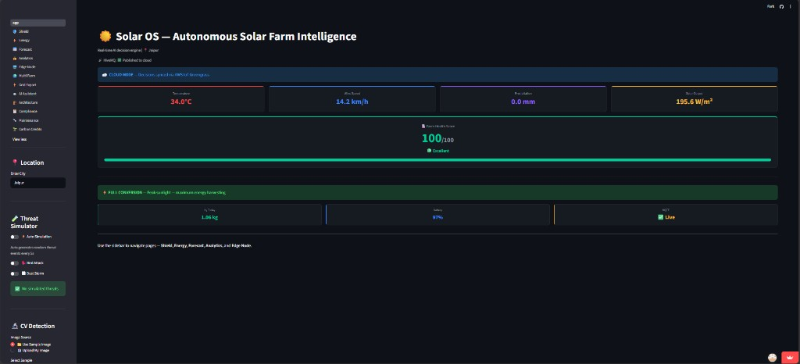

### Shield — Protection + CV Threat Detection
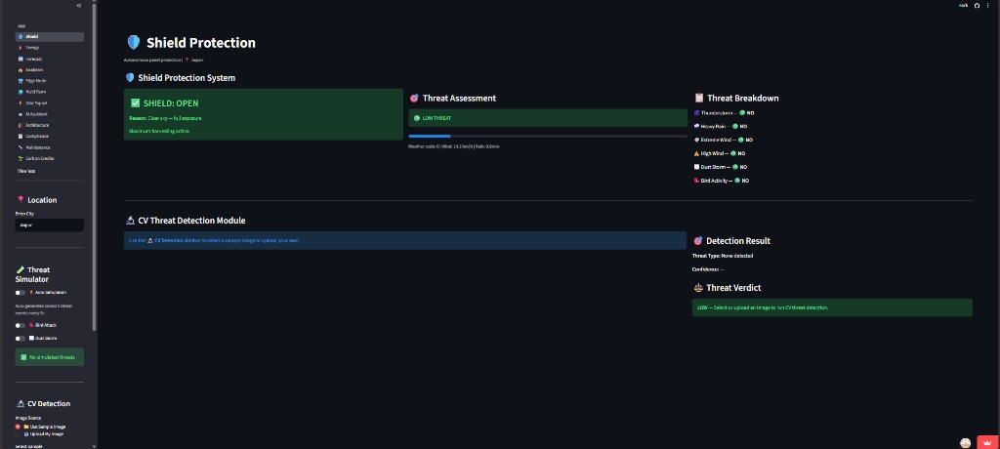
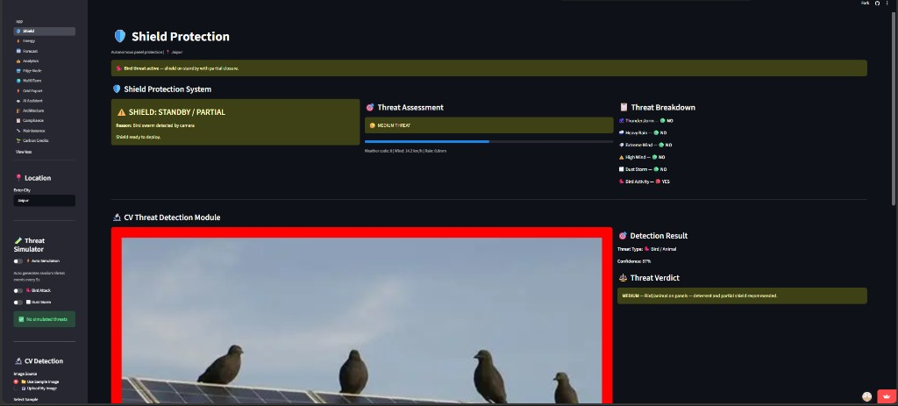

### Energy — Radiation Chart, Battery & H₂
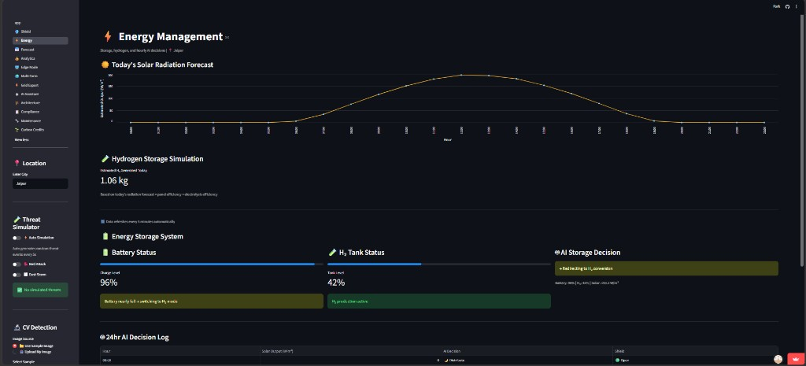

### Multi-Farm — India Fleet Map
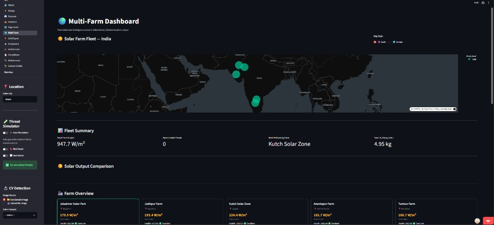

### Grid Export — Time-of-Day Optimization
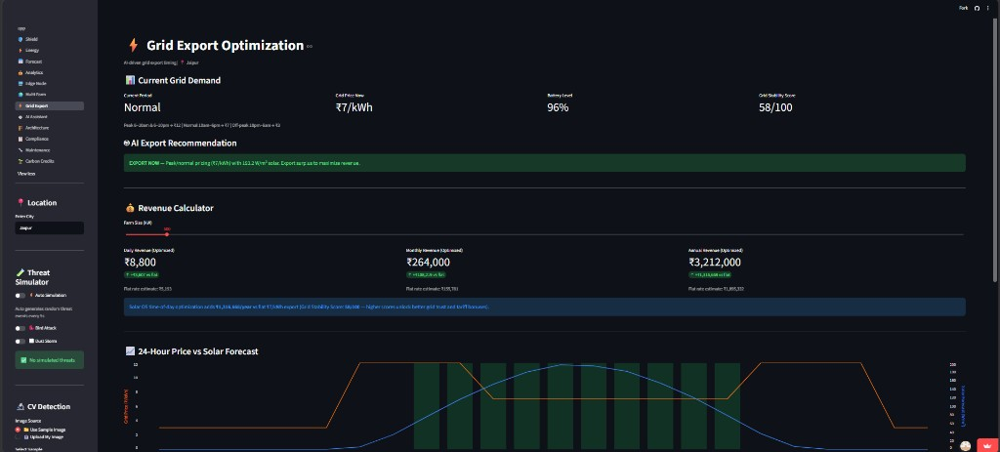

### Edge Node — RPi4 Simulation + MQTT + Alerts
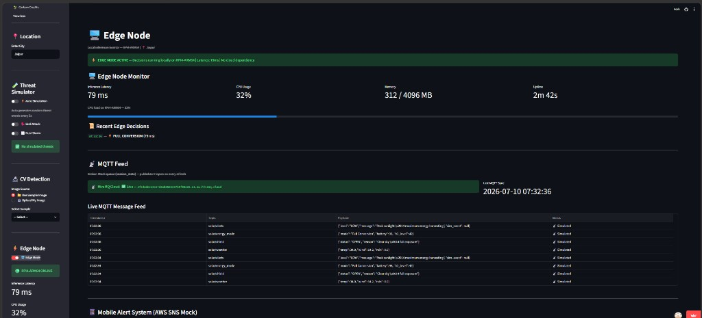
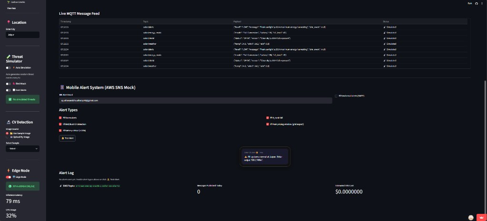

### AI Assistant — Groq Chat with Live Farm Context
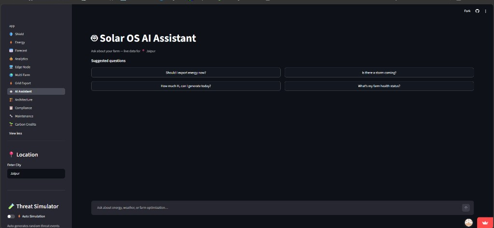

### Architecture — System Data-Flow Map
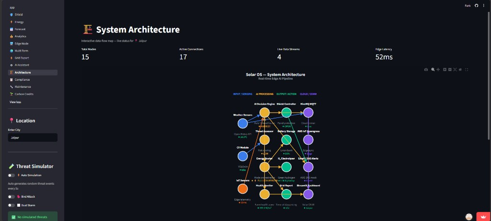

### Analytics — Savings Calculator + 25-Year ROI
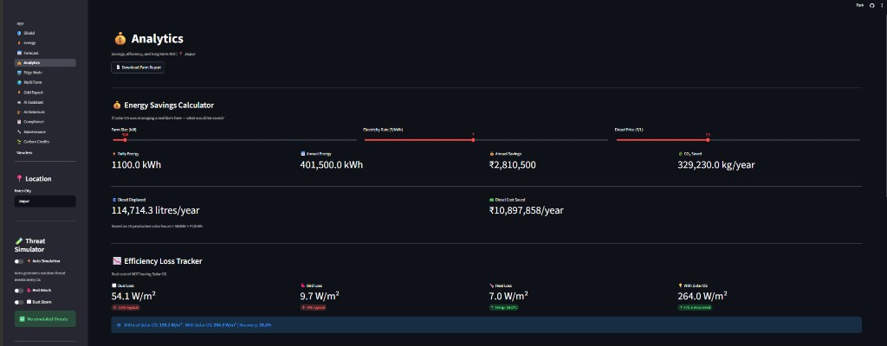
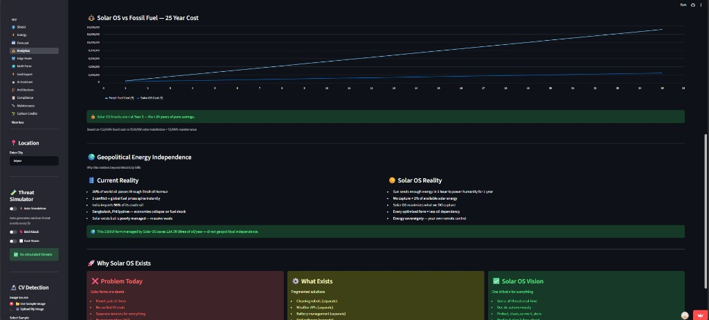

### Carbon Credits — ESG Dashboard
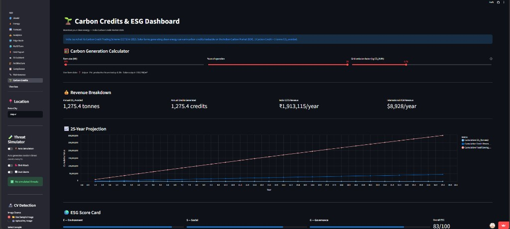

### Maintenance — Predictive Health & Calendar
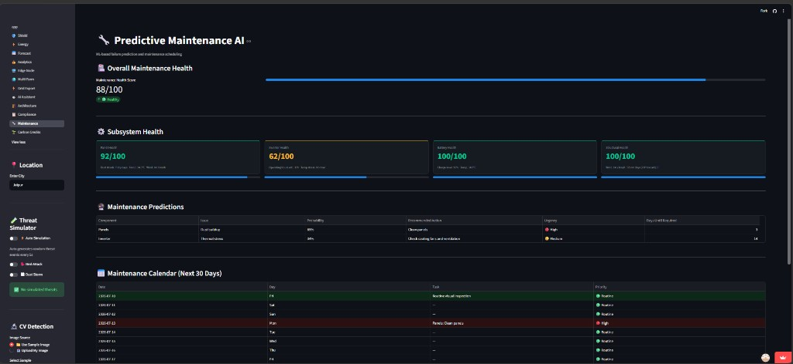

### Compliance — CEA 2026 Checker
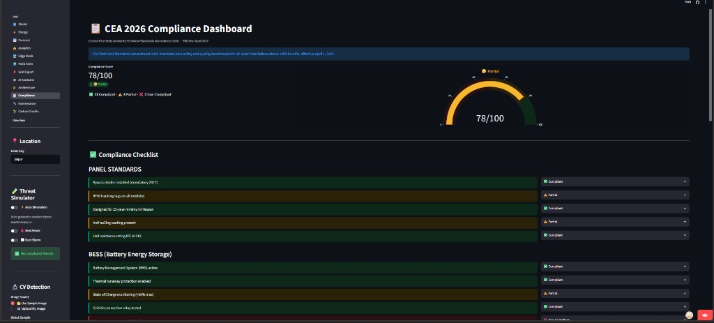

---

## 👨‍💻 Built By

Ayush Anand
GitHub: [github.com/ayushanand27](https://github.com/ayushanand27)

---

<p align="center">
  <b>☀️ Solar OS</b> — Sense. Decide. Act. Distribute.
</p>
